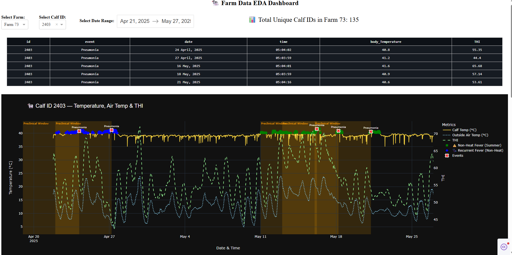
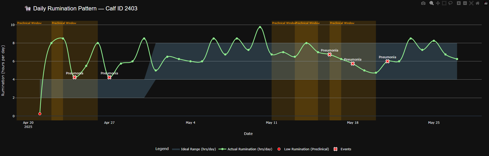
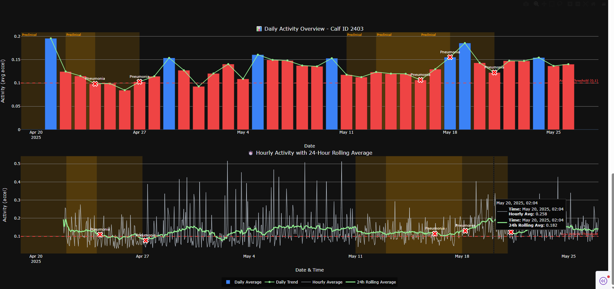

# Livestock Monitoring Dashboard

## Overview
The Livestock Monitoring Dashboard is a comprehensive solution designed to monitor, visualize, and analyze livestock health data in real-time. This project leverages machine learning models and data visualization techniques to provide actionable insights that help improve animal health management and farm productivity. The dashboard facilitates early detection of health anomalies and supports decision-making through intuitive and interactive charts.

## Project Structure
```
calf-health-dashboard/
│
├── Data/   # Folder for raw and processed datasets (not publicly shared)
│
├── Dashboard/
│   └── Dashboard.ipynb              # Main dashboard application
│
├── Outputs/
│   ├── Activity-plot.png
│   ├── Rumination-plot.png
│   └── Temp-plot.png
│
├── Pre-Processing/
│   ├── DataCleaning.ipynb
│   ├── ExploratoryDataAnalysis.ipynb
│   └── mergeAnimalData.ipynb
│
└── README.md
```

## Tech Stack
- **Python**: Core programming language for data processing and dashboard development
- **Plotly Dash**: Framework used to build the interactive web dashboard
- **Pandas & NumPy**: Data manipulation and numerical computing
- **Matplotlib & Plotly**: Data visualization libraries for creating charts and graphs

**📊 Multi-Metric Health Monitoring**
- **Temperature Analysis**: Real-time body temperature tracking with heat stress detection, fever classification (heat stress, non-heat, recurrent), and THI (Temperature-Humidity Index) correlation
- **Rumination Tracking**: Age-based ideal range comparison with daily pattern analysis and preclinical alerts
- **Activity Monitoring**: Dual-scale visualization featuring daily overview with color-coded thresholds and hourly detail with 24-hour rolling averages

**🔍 Intelligent Event Detection**
- Automated preclinical window identification (5 days before clinical events)
- Event markers synchronized across all health metric plots
- Low activity and abnormal rumination alerts
- Historical event tracking with timestamps and conditions

**⚡ Interactive Analytics**
- Dynamic farm and calf selection with real-time data updates
- Customizable date range filtering
- Hover tooltips for detailed metric insights
- Event correlation table with body temperature and THI values

## Data Specifications

- **Frequency**: 15-minute intervals (96 records per day)
- **Metrics**: Body temperature, ambient temperature, humidity, rumination, acceleration
- **Derived Features**: THI, rolling averages, age-based thresholds
- **Clinical Events**: Timestamped health incidents with symptom logging


## Installation
```bash
# Clone the repository
git clone https://github.com/yourusername/calf-health-dashboard.git
cd calf-health-dashboard

# Install dependencies
pip install -r requirements.txt

# Run the dashboard
jupyter notebook Dashboard/Dashboard.ipynb
```

## Usage

1. Select a farm from the dropdown menu
2. Choose a specific calf ID to analyze
3. Set the date range for visualization
4. Review the event table for clinical history
5. Analyze temperature, rumination, and activity plots for health insights
6. Identify preclinical windows highlighted in orange before events

## Sample Visualizations





## Contributing

Contributions are welcome! Please open an issue or submit a pull request for any improvements.


## Contact

[Rashesh Desai - Data Analyst]  
[Cattle Scan]
[rasheshdesai09@gmail.com]  
[https://www.linkedin.com/in/rashesh-desai]
